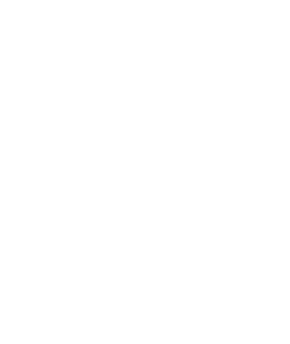

# Latte with Lata - logo usage

Production logo files generated from the client's brand kit (`assets/brand/logo/latte_with_lata_{brown,white,black}.svg`,
1080x1080 traces) and the Creato Display OTFs (`assets/brand/fonts/creato_display/`, SIL OFL). Generator + verification
report: scratch `brand-run/logo/` (`gen.py`, `verify-report.json`, `contact-sheet.png`). Nothing here is hand-drawn:
the cup / steam / saucer path data is the kit's own, byte-for-byte in geometry (rewritten to lossless relative integer
commands, no-op segments dropped, 29.7 KB -> 9.4 KB).

## File map

| Use | File | viewBox | Colour | Size in the page |
|---|---|---|---|---|
| Header (all states, incl. brown plate) | `assets/brand/logo/latte-with-lata-mark-white.svg` as ``, or `<use href="assets/svg/mark.svg#mark">` with `color:#fff` | `299 181 482 571` | white | 44px tall (56px at >= 60em) + wordmark text 15px Creato Bold uppercase ls .12em; mobile: mark only |
| Drawer | same white mark | `299 181 482 571` | white | 72px tall |
| Hero | white mark ABOVE the live two-line wordmark, tagline below | `299 181 482 571` | white | 96-128px tall |
| Stamp (`.strip--stamp::after`) | `assets/svg/mark.svg` (mask, `background: var(--colStamp)`) | `0 0 482 571` | brown on white bands, white on brown bands | existing 5em / 7em box, unchanged |
| Footer | `assets/brand/logo/latte-with-lata-mark-brown.svg` + tagline under it | `299 181 482 571` | brown `#502506` | 120px tall |
| Favicon | `assets/svg/favicon.svg` (brown mark on a white square) | `0 0 64 64` | brown on white | 16-64px |
| Social / OG | `assets/images/og-image.jpg` 1200x630 (brown ground, white stacked lockup) | - | white on brown | og:image / twitter:image |
| Horizontal lockup (print, partners, email signatures) | `assets/brand/logo/lockup-horizontal-{brown,white}.svg` | `299 181 2571.9 571` | brown / white | min height 32px |
| Stacked lockup with tagline (covers, social avatars' companion, OG) | `assets/brand/logo/lockup-stacked-{brown,white}.svg` | `239.8 181 600.4 763.8` | brown / white | min height 160px (tagline legible from ~200px) |
| Black mark (mono print only) | `assets/brand/logo/latte-with-lata-mark-black.svg` | `299 181 482 571` | `#000` | never on the web page |
| currentColor mark (inline / `<use>`) | `assets/brand/logo/latte-with-lata-mark-current.svg` = `assets/svg/mark.svg` | `0 0 482 571` | `currentColor` | any |

The kit's PNG/SVG exports (`latte_with_lata_*.svg`, `logo-*.png`) stay on disk untouched as the source of record.

## The mark

- Artwork bounds in the kit's 1080 canvas: x 310-770, y 192-741 (460 x 549). viewBox `299 181 482 571` = the bounds plus
  2% padding (11 units) on every side. Aspect ratio 482:571 = **0.844** (width = 0.844 x height).
- One `<path fill-rule="evenodd">`, 17 sub-paths (steam x4, cup rim + latte art + LATA lettering x12, saucer x1).
- The kit trace also contained the tagline as a 25-unit-tall bitmap trace under the cup (47 sub-paths). It is NOT part of
  the mark: it is illegible below ~300px and the tagline ships as live text on the page and as crisp Creato Display
  outlines in the stacked lockup.
- Saucer bounds: x 319-759, y 676-741 -> **saucer height = 65 units = 11.4% of the mark's height**.

### Sizes (height -> width, clear space)

| Height | Width | Clear space (saucer) | Where |
|---|---|---|---|
| 16px | 13.5px | - (favicon only) | favicon (reads as a cup silhouette) |
| 32px | 27px | 3.6px | minimum on the web page (the LATA lettering resolves) |
| 44px | 37px | 5px | header (mobile + desktop < 60em) |
| 56px | 47px | 6.4px | header >= 60em |
| 72px | 61px | 8.2px | drawer |
| 96px | 81px | 10.9px | hero (small) |
| 120px | 101px | 13.7px | footer, stamp box (7em at 16px = 112px) |
| 128px | 108px | 14.6px | hero (large) |

Minimum size: 32px tall on screen (24px absolute floor, favicon exempt), 10mm in print.

### Clear space

Keep at least the saucer's height (11.4% of the mark's height) free on all four sides - nothing (text, edges, other
marks) inside that zone. The header wordmark text starts one clear-space to the right of the mark; the footer tagline
starts one clear-space below it. The lockup files bake this gap in (65 units).

## Colour rules

- Three colours only: espresso brown `#502506` (`--colBrand`), white `#ffffff`, black `#000000` (mono print only).
- Brown mark on white / `--colBrandSoft #f6efe7`; white mark on `--colBrand #502506`, `--colBrandDeep #2f1604` and the
  accent band `--colAccent #81532e`; the stamp on the accent band may use `--colAccentTint #c9a98f` via `--colStamp`.
- Never: the brown mark on brown / accent; tints, gradients or shadows on the mark; recolouring outside these three;
  stretching (always `height` + `width:auto`, or `object-fit: contain`); rotating; adding a stroke; putting the mark on
  photography without a >= 40% dark overlay (then white).
- The kit's trace used `#472105`; the brown files use the token value `#502506` so the mark matches every brown surface.

## Markup contracts

Decorative use inside a link that already carries `aria-label` (header, footer):

```html
<a class="header__logo" href="#top" aria-label="Latte with Lata">
  
  <span class="header__wordmark" aria-hidden="true">Latte with Lata</span>
</a>
```
CSS: `.header__mark { height: 44px; width: auto } @media (min-width: 60em) { .header__mark { height: 56px } }`.
`width`/`height` attributes = the viewBox size so the browser reserves the 0.844 box before the SVG loads (no CLS).

currentColor use (when the colour must follow `color:`):

```html
<svg class="footer__mark" viewBox="0 0 482 571" aria-hidden="true" focusable="false"><use href="assets/svg/mark.svg#mark"/></svg>
```
Note the consumer's viewBox is `0 0 482 571` (the symbol carries the `299 181 482 571` box itself). Same-origin only.

Stamp (already wired in `css/base.css`): `mask: url("../assets/svg/mark.svg") no-repeat 50% 50% / contain` on a
`background: var(--colStamp)` box - the mark is 0.844 wide, so `contain` fits the height and centres horizontally.

## Lockups

- Horizontal: mark (571 tall) + one clear-space (65) + "LATTE WITH LATA" in Creato Display Bold outlines at 195 units
  (= the header ratio 15px : 44px), tracking .12em, cap-height centred on the mark box. Total viewBox 2571.9 x 571
  (ratio 4.5 : 1).
- Stacked: mark, one clear-space, wordmark (Bold, tracking .12em, width = 1.2 x mark width), 0.6 clear-space, tagline
  "Real Conversations. Built on Purpose." in Creato Display Regular (sentence case, width = 0.92 x wordmark).
  viewBox 600.4 x 763.8 (ratio 0.786).
- Both are pure outlines (no `<text>`, no font dependency) and carry `<title>`; kerning is the font's advance widths
  only (no GPOS pairs applied - at .12em tracking the difference is invisible).

## Verification (2026-09-17, Chrome headless via Playwright, server on :5302)

All ten SVGs: served as `image/svg+xml`, no `width`/`height` attributes, `<title>` present, `getBBox()` equals the
artwork bounds listed above, fills resolve to `rgb(80,37,6)` / `rgb(255,255,255)` / `rgb(0,0,0)` / the inherited
`color` for currentColor; the mask, `` and external `<use>` paths all render (contact sheet 16-128px on white,
brown and accent). OG image: 1200x630 JPEG q88, 38.9 KB.
